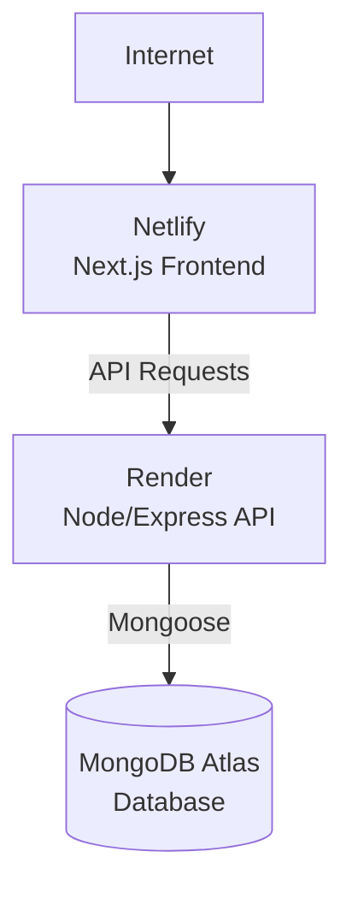

# Group 39 E-Commerce Project Report

| | |
|---|---|
| **Project Title** | E-Commerce Website and Order Management System |
| **Team** | Group 39 |
| **Programme** | TS Academy – Software Development |
| **Project Type** | Full-Stack E-Commerce Web Application |
| **Frontend** | Next.js / React |
| **Backend** | Node.js / Express.js |
| **Database** | MongoDB Atlas |

### Deployed Application

- **Frontend:** [group39-eccommerce.netlify.app](https://group39-eccommerce.netlify.app/)
- **Backend API:** [capstone-group-39-ecommerce-api.onrender.com](https://capstone-group-39-ecommerce-api.onrender.com/)

---

## Table of Contents

1. [Executive Summary](#1-executive-summary)
2. [Introduction](#2-introduction)
3. [Problem Statement](#3-problem-statement)
4. [Project Objectives](#4-project-objectives)
5. [Project Features](#5-project-features)
6. [User Authentication](#6-user-authentication)
7. [Shopping Cart](#7-shopping-cart)
8. [Checkout and Demo Payment](#8-checkout-and-demo-payment)
9. [Order Management](#9-order-management)
10. [Administrator Functionality](#10-administrator-functionality)
11. [Audit Logging](#11-audit-logging)
12. [Backend Architecture](#12-backend-architecture)
13. [Frontend Architecture](#13-frontend-architecture)
14. [Database](#14-database)
15. [API Integration](#15-api-integration)
16. [Product Seeding](#16-product-seeding)
17. [Testing](#17-testing)
18. [Security Considerations](#18-security-considerations)
19. [Deployment](#19-deployment)
20. [Git and Version Control](#20-git-and-version-control)
21. [Challenges Encountered](#21-challenges-encountered)
22. [Limitations](#22-limitations)
23. [Future Improvements](#23-future-improvements)
24. [Team Contribution](#24-team-contribution)
25. [Project Workflow](#25-project-workflow)
26. [Conclusion](#26-conclusion)
27. [Project Links](#27-project-links)

---

## 1. Executive Summary

Group 39 developed a full-stack e-commerce web application that allows users to browse products, create accounts, manage their shopping cart, place orders and view their order history.

The application consists of a modern frontend connected to a RESTful backend API. Product, user, cart and order information is persisted using MongoDB, while authentication and authorization distinguish ordinary users from administrators.

The application also provides an administrative workflow through which authorized administrators can manage products and monitor relevant system activities.

The project was developed to demonstrate practical knowledge of:

- Frontend development
- Backend API development
- Database management
- Authentication and authorization
- Testing
- Git/GitHub collaboration
- Cloud deployment

---

## 2. Introduction

E-commerce has become an important part of modern business, allowing customers to discover and purchase products online without visiting a physical store.

The purpose of this project was to design and develop an e-commerce platform that demonstrates the major components required in a modern online shopping system.

The application provides a complete flow from product discovery to cart management and order placement, while maintaining a separation between the frontend, backend and database layers.

MongoDB stores application data as documents within collections, making it suitable for storing products, users, carts, orders and other application records.

---

## 3. Problem Statement

Traditional shopping systems can make it difficult for customers to conveniently browse products, manage purchases and track previous orders.

The project therefore addresses the need for a simple web-based shopping platform where users can:

- Browse available products.
- View product information.
- Add products to their cart.
- Modify cart quantities.
- Remove products from the cart.
- Complete a checkout process.
- View previously placed orders.

The system also provides administrative functionality for managing the product catalogue.

---

## 4. Project Objectives

The main objectives of the project were to:

- Develop a functional e-commerce website.
- Create a responsive and user-friendly frontend.
- Develop a RESTful backend API.
- Connect the frontend to the backend through API requests.
- Store application data using MongoDB.
- Implement user registration and login.
- Implement authentication and authorization.
- Provide shopping cart functionality.
- Implement an order and checkout workflow.
- Provide administrator product management.
- Implement audit logging for important system activities.
- Test the major application workflows.
- Deploy the application to the internet.

---

## 5. Project Features

### Product Catalogue

The application provides a product catalogue containing products from different categories:

- Clothing
- Electronics
- Mobile devices
- Watches
- Beauty and skincare
- Home décor
- Kitchen appliances
- Toys and games

Each product can contain the following information:

| Field | Description |
|---|---|
| Product name | Display name of the product |
| Brand | Manufacturer or brand |
| Category | Product category |
| Description | Product details |
| Price | Current price |
| Discount | Discount applied |
| Previous price | Price before discount |
| Rating | Customer rating |
| Stock quantity | Available units |
| Product image | Image URL |
| Badge | Promotional label |
| Colour | Product colour |

Products are retrieved from the backend API rather than being hardcoded into the frontend.

---

## 6. User Authentication

Users can create an account and sign in to the application.

The authentication system allows the backend to identify users and control access to protected resources. It is particularly important for:

- User carts
- Orders
- Account-specific information

Authorization is also implemented so that administrative functionality is restricted to users with the administrator role.

---

## 7. Shopping Cart

The shopping cart allows users to select products before placing an order.

Users can:

- Add products to their cart.
- Increase product quantities.
- Decrease product quantities.
- Remove products.
- View the cart total.
- Proceed to checkout.

Cart information is managed through the backend and persisted in MongoDB.

---

## 8. Checkout and Demo Payment

The checkout system provides users with:

- Shipping information fields
- Order summary
- Product quantities
- Subtotal
- Total amount
- Demo card number field
- Card expiry date field
- CVV field


The card information entered during the demo checkout is used only for client-side validation and is not sent to the backend as part of the order request. This allows the team to demonstrate a realistic checkout interface without handling real payment information.

---

## 9. Order Management

After checkout, the backend creates an order using information stored in the user's cart.

The backend calculates the order total from the persisted cart items and quantities rather than relying on an amount supplied by the frontend. This ensures the backend remains the source of truth for the order amount.

Users can access the **My Orders** section to view previously created orders.

An order may contain multiple products. In MongoDB Atlas, the `items` field therefore appears as an array. For example, `Array (2)` means the order contains two items. The Atlas interface supports expanding arrays and embedded documents to inspect their contents.

---

## 10. Administrator Functionality

The application provides protected administrator functionality. An administrator can manage products through the backend API.

### Create Product

An administrator can add a new product by submitting the required product information to the protected admin endpoint.

### Update Product

An administrator can modify existing product information, such as:

- Name
- Price
- Stock
- Category
- Description
- Image
- Brand
- Discount information

### Delete Product

An administrator can remove products that are no longer required.

> Administrative endpoints are protected using authentication and administrator authorization middleware.

---

## 11. Audit Logging

The application includes an audit logging feature that records important system activities. Examples include successful:

- Registration
- Login
- Cart operations
- Order creation
- Administrative actions

Audit logging provides an additional level of visibility into important activities performed within the application.

---

## 12. Backend Architecture

The backend was developed using Node.js and Express.js, following a structured layered architecture:

```text
Routes
   ↓
Controllers
   ↓
Services
   ↓
Models
   ↓
MongoDB
```

| Layer | Responsibility |
|---|---|
| **Routes** | Define the API endpoints available to the frontend and other clients |
| **Controllers** | Receive requests and return appropriate responses |
| **Services** | Contain application/business logic, such as product management and order calculations |
| **Models** | Mongoose models that define the structure of data stored in MongoDB |

This separation makes the backend easier to maintain and extend.

---

## 13. Frontend Architecture

The frontend was developed using Next.js and React and communicates with the backend through HTTP API requests.

General application flow:

```text
User
 ↓
Next.js / React Frontend
 ↓
REST API Request
 ↓
Express.js Backend
 ↓
Service Layer
 ↓
Mongoose
 ↓
MongoDB Atlas
```

Example: when a user views products:

```text
Frontend
   ↓
GET /api/products
   ↓
Backend
   ↓
Product Service
   ↓
MongoDB
   ↓
Products returned to frontend
```

This architecture separates the user interface from the application's business logic and database.

---

## 14. Database

The project uses **MongoDB Atlas** as its cloud database. MongoDB stores records as documents within collections.

Major collections:

| Collection | Purpose |
|---|---|
| `users` | User accounts and roles |
| `products` | Product catalogue |
| `carts` | User shopping carts |
| `orders` | Placed orders |
| `auditlogs` | Records of important system activities |

An order can contain multiple products through an array of order items. This allows a single order document to represent the complete purchase.

---

## 15. API Integration

The frontend communicates with the backend through the deployed API for operations such as:

- User registration
- User login
- Product retrieval
- Cart management
- Order creation
- Order retrieval
- Administrative product operations

The frontend does not need direct access to the MongoDB database:

```text
Frontend → Backend API → MongoDB
```

This improves security and maintains a clear separation between the application layers.

---

## 16. Product Seeding

A product seed system was implemented to populate the product catalogue with an initial set of products.

The seed process is designed to be repeatable and includes protection against accidentally seeding an unintended remote database. This allowed the team to populate the application with the products displayed on the deployed website.

---

## 17. Testing

Testing was performed on important backend and frontend functionality.

### Backend

Testing covered:

- Product catalogue validation
- Product seed behaviour
- Order calculations
- Order sorting
- Audit logging

The backend test suite was successfully verified with **8 test suites and 25 tests**.

### Frontend

Verification included:

- TypeScript checking
- ESLint checking
- Checkout validation
- API integration
- Product display
- Cart workflow
- Order creation

Additional manual testing was performed on the deployed application.

---

## 18. Security Considerations

Several security practices were implemented:

- Authentication for protected user functionality.
- Authorization for administrator functionality.
- Environment variables for sensitive configuration.
- Backend-controlled order totals.
- Protection of administrative endpoints.
- Demo card details are not stored in the database.
- Separation of frontend and backend responsibilities.

Sensitive credentials such as database passwords and JWT secrets are not committed to the GitHub repository.

---

## 19. Deployment

The project was deployed using cloud services:

| Layer | Platform |
|---|---|
| Frontend | Netlify |
| Backend | Render |
| Database | MongoDB Atlas |

Netlify supports Next.js applications and can automatically detect supported frameworks when a repository is connected.

Resulting architecture:



---

## 20. Git and Version Control

Git and GitHub were used for source-code management and team collaboration. The project was developed using feature branches before changes were merged into the main branch.

The repository allowed team members to:

- Track changes.
- Review code.
- Commit features independently.
- Push changes to the remote repository.
- Merge completed work.
- Maintain project history.

This workflow reduced the risk of losing work and provided a clear history of project development.

---

## 21. Challenges Encountered

### Database Access

There were challenges around MongoDB Atlas project permissions and database-user access. The team eventually connected the application to the intended database and successfully populated the product catalogue.

### Frontend/Backend Integration

Connecting the frontend to the deployed backend required configuring the API base URL and environment variables.

### Order Total Calculation

The backend used an incorrectly named variable when creating an order. This was identified and corrected so that the backend calculates and stores the correct order total.

### Order Display

An issue with sorting order records was identified and corrected.

### Checkout Validation

The checkout interface initially did not provide card fields. The checkout modal was enhanced to provide:

- Card number
- Expiry date
- CVV
- Shipping address
- Order summary

Because the project uses a demo payment system, these details are only used for client-side validation.

### Deployment

The team encountered deployment configuration issues while deploying the Next.js frontend. These were resolved through proper environment variable and deployment configuration.

---

## 22. Limitations

Although the application demonstrates the major functionality of an e-commerce platform, some limitations remain:

- **Demo payment:** The application does not process real payments. A provider such as Paystack, Flutterwave or Stripe would be required for production.
- **Product images:** Images currently rely on externally hosted URLs.
- **Advanced administration:** The admin interface could be expanded into a dedicated dashboard with richer analytics and management tools.
- **Shipping integration:** The project does not integrate with a real logistics provider.

---

## 23. Future Improvements

- Integration with a real payment gateway
- Email confirmation after order placement
- Password reset functionality
- Dedicated admin dashboard
- Product reviews and ratings
- Wishlist persistence
- Advanced product filtering
- Real-time stock management
- Shipping and delivery tracking
- Customer notifications
- Sales analytics for administrators
- Improved image management
- More comprehensive automated end-to-end testing

---

## 24. Team Contribution

The project was developed collaboratively by the members of Group 39. Team members contributed to different aspects of the project, including:

- Frontend development
- Backend API development
- Database integration
- Authentication and authorization
- Product catalogue development
- Cart and order functionality
- Testing and debugging
- Documentation
- Deployment
- Project coordination

| Name | Email | Contribution |
|---|---|---|
| Ekhator Favour Osazuwamwen | ekhatorfavour01@gmail.com | _Ordering & Checkout System, Admin Controls and Operations, core infracstructure security and testing_ |
| Uche Philip Kalu | philipuchekalu89@gmail.com | _Product Testing_ |
| Muhideen Yunus | muhiddeenyunus@gmail.com | _Front-end Development_ |
| Oreoluwa Kofoworola | oreoluwakofoworola243@gmail.com | _Shopping Cart Mechanics_ |
| Oluwasegun Opeyemi Solomon | opeyemisolomon906@gmail.com | _Frontend–Backend API Integration, Product Catalog Integration & Product Display, Backend Testing & Debugging, Deployment & Project Documentation_ |
| Trendy | boluwatifeogunkoya77@gmail.com | _Product Management_ |

---

## 25. Project Workflow

### User Workflow

```text
Visit Website
      ↓
Browse Products
      ↓
Select Product
      ↓
Add to Cart
      ↓
View Cart
      ↓
Proceed to Checkout
      ↓
Enter Shipping Information
      ↓
Enter Demo Card Details
      ↓
Validate Checkout
      ↓
Create Order
      ↓
Store Order in MongoDB
      ↓
View Order in "My Orders"
```

### Administrator Workflow

```text
Administrator Login
       ↓
Authentication
       ↓
Admin Authorization
       ↓
Access Admin API
       ↓
Create / Update / Delete Products
       ↓
Changes Stored in MongoDB
       ↓
Updated Products Available Through API
       ↓
Frontend Displays Updated Catalogue
```

---

## 26. Conclusion

Group 39 successfully designed and developed a full-stack e-commerce application that demonstrates the practical application of modern web development technologies.

The project combines a Next.js/React frontend, Node.js/Express backend, MongoDB Atlas database, authentication, authorization, product management, shopping cart functionality, checkout, order management and audit logging.

The application was tested across its major workflows and successfully deployed online.

The project also provided practical experience in collaborative software development, Git/GitHub workflows, API integration, database management, debugging, testing and cloud deployment.

Overall, the project demonstrates the team's ability to take an application from development through testing and deployment into a working full-stack web solution.

---

## 27. Project Links

- **Live Application:** [Group 39 E-Commerce Website](https://group39-eccommerce.netlify.app/)
- **Backend API:** [Group 39 E-Commerce API](https://capstone-group-39-ecommerce-api.onrender.com/)
- **GitHub Repository:** [Group 39 Repository](https://github.com/ekhatorfavour01-rgb/Final-Capstone-Project-Group-39-)
